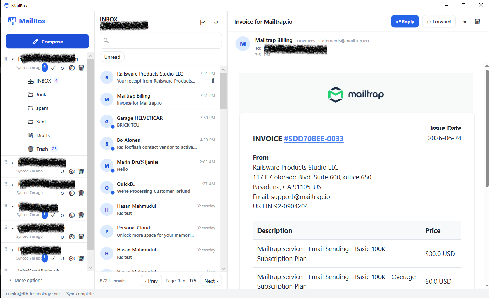

# MailBox Desktop

A standalone WPF desktop email client for Windows, built with .NET 8. Ships as a single self-contained `.exe` — no installer, no runtime dependency, no web server required.

  

---

## Features

- **Multi-account** — manage any number of IMAP/SMTP email accounts simultaneously
- **Incremental sync** — UID-range sync fetches only new messages; avoids re-downloading the full mailbox
- **Background sync** — parallel per-account sync every 5 minutes with per-account semaphore locking
- **Toast notifications** — Windows Action Center toasts + sound on new mail arrival
- **Compose & reply** — full HTML editor (WebView2), reply/forward with Gmail-style quoted blockquotes, CC/BCC, recipient autocomplete
- **Attachments** — view, open, and save email attachments; inline attachment download on demand
- **Multi-select & bulk delete** — checkbox select mode in the email list; Delete key or toolbar button; moves to Trash or permanently deletes
- **On-demand body fetch** — emails synced on a restricted network without body content show a "Load now" button to fetch on demand
- **Body backfill** — each sync pass automatically re-downloads body content for any previously body-less emails
- **SOCKS5 proxy** — per-account proxy configuration routes all IMAP and SMTP traffic through a SOCKS5 proxy (useful for VPN/restricted networks)
- **Offline mode** — when IMAP is unreachable, the sidebar falls back to folders cached in local SQLite so you can browse downloaded mail
- **Mark all as read** — one-click per account from the sidebar
- **Backup & restore** — zip the entire `%APPDATA%\MailBox\` folder (accounts, mail stores, attachments) and restore from backup
- **Logs viewer** — filterable IMAP/SMTP activity log with success/error status
- **System tray** — minimize to tray, compose from tray, backup/restore from tray context menu
- **Account drag-reorder** — drag accounts in the sidebar to reorder them
- **SSL bypass** — optional certificate validation bypass for self-signed or restricted-network mail servers

---

## Screenshots



---

## Requirements

- Windows 10 (1809 / build 17763) or later
- No other runtime required — the published `.exe` is fully self-contained

---

## Build

```powershell
# .NET 10 SDK required (https://dotnet.microsoft.com/download)

# Debug build
dotnet build "MailBox\MailBox.csproj"

# Release — single-file self-contained exe
dotnet publish "MailBox\MailBox.csproj" -c Release -r win-x64 --self-contained -p:PublishSingleFile=true -o "publish"

# Run
.\publish\MailBox.exe
```

Output binary is ~74 MB and has no external dependencies.

---

## Data Storage

All data is stored under `%APPDATA%\MailBox\` — never next to the exe:

```
%APPDATA%\MailBox\
├── accounts.db              ← account settings + activity logs
├── maildata\
│   └── user@example.com.sqlite   ← per-account mail store
└── mail\
    └── {accountId}\{emailId}\    ← attachment binary files
```

Passwords are encrypted with Windows DPAPI (machine + user scoped).

---

## Architecture

Built with the **MVVM** pattern using [CommunityToolkit.Mvvm](https://github.com/CommunityToolkit/dotnet) source generators and a **.NET Generic Host** DI container.

```
App (Generic Host)
 ├── AccountRepository       SQLite CRUD for accounts + logs
 ├── ImapSyncService         MailKit IMAP, UID-range sync, body/attachment fetch
 ├── SmtpSendService         MailKit SMTP send + Sent-folder append
 ├── BackgroundSyncService   IHostedService — parallel sync loop every 5 min
 ├── NotificationService     WinRT toast + WAV sound playback
 └── MainViewModel
      ├── SidebarViewModel   Account list, folder tree, unread counts
      ├── EmailListViewModel Email rows, search, pagination, multi-select
      └── EmailViewerViewModel  HTML body (WebView2), attachments, reply/forward
```

### Key packages

| Package | Purpose |
|---------|---------|
| [MailKit](https://github.com/jstedfast/MailKit) | IMAP / SMTP protocol |
| [Microsoft.Data.Sqlite](https://learn.microsoft.com/en-us/dotnet/standard/data/sqlite/) | Per-account SQLite mail stores |
| [Dapper](https://github.com/DapperLib/Dapper) | Micro-ORM for SQLite |
| [CommunityToolkit.Mvvm](https://github.com/CommunityToolkit/dotnet) | MVVM source generators |
| [Microsoft.Web.WebView2](https://developer.microsoft.com/en-us/microsoft-edge/webview2/) | HTML email rendering + compose editor |
| [H.NotifyIcon.Wpf](https://github.com/HavenDV/H.NotifyIcon) | System tray icon |
| [HtmlSanitizer](https://github.com/mganss/HtmlSanitizer) | Sanitize HTML bodies before display |

---

## Account Setup

1. Open **MailBox** and click **+ Add Account** in the sidebar
2. Use a quick-setup preset (Gmail, Outlook, Yahoo, iCloud) or enter server details manually
3. For Gmail — use an [App Password](https://myaccount.google.com/apppasswords), not your regular password
4. For Outlook — enable SMTP AUTH in Outlook settings if MFA is active
5. Optionally configure a **SOCKS5 proxy** (host + port) if on a restricted network

---

## Companion Web App

This desktop client shares its SQLite schema with a companion **Laravel 12 + Livewire 3** web app located at `E:\xampp\htdocs\mailbox`. Per-account `.sqlite` files are cross-compatible between the two — the same mail store can be read by either app.

---

## Roadmap

- [ ] Tray icon image (`mailbox.ico`)
- [ ] Import wizard from Laravel companion app
- [ ] NSIS / Squirrel installer for distribution
- [ ] Draft auto-save
- [ ] Attachment drag-and-drop into compose window
- [ ] Cross-folder search
- [ ] Mark all as read per folder
